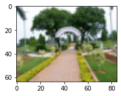
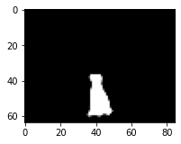
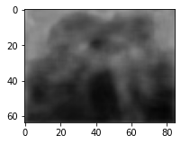
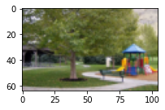
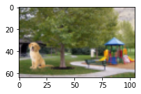
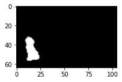
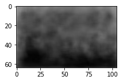

# EVA4 15 : Mask & Depth Prediction

### Submitted By ###
Deepjyoti Saha

## Overview
Till now, I have been playing with classification problems, which predict classes in a given image. In this exercise I have built a DNN which predicts images! This network takes two input images - an image with a foreground object & a background scene, and an image with only the background scene, and generates the mask for the foreground object and a depthmap of the image. How cool is that!

### Usage
```python

from utils import predict

## modelpath = <Absolute Path for Model File>
## filepath = <Absolute Path for Test Image Files>
## bg = <Filename for Background Image>
## image = <Filename for Image>

predict.predict_images(modelpath, filepath, bg,  image)
```

### Input & Output Images ###
The results were generated with input images that network has never seen.

|    Background (Input)     |     Image (Input).    |    Predicted Mask (Output).  | Predicted Depthmap (Output) |
| ---------------- | ---------------- | -------------- | ------------------ |
|   |   |   |   |
|   |   |   |   |
|   |   |   |   |
|   |   |   |   |

### Model


## Solution

### Problem Statement
In this exercise I attempted to build DNN which takes two input images - an image with a foreground object & a background scene, and an image with only the background scene, and generates the mask for the foreground object and a depthmap of the image.

### Approach
The approach is to build a DNN using ideas from the RESNET architecture, and then design the tail to predict output images instead of labels. I have then used suitable loss functions to train the network to learn the patterns and predict the mask and depthmap images. I have used two different heads and different loss functions for the mask and depthmap prediction. 

### Dataset 
The dataset consists of the following images sets: </br>
* Background Images: These are images of a scene, in this case a park. 
* Foreground Images: These are images of an object, in this case a dog with a transparent background.
* Foreground Mask Images:These are the mask images of the foreground image. 
* Generated Images: These are images generated by superimposing the object on the scene, i.e, the dog on the park. For each foreground and background combination, the foreground images is superimposed at 20 random positions, and again flipped superimposed at 20 random postitions. 
* Mask for Generated Images: This is the mask for generated images. 
* Depthmap Images: These are the depthmap images of the generated image, these are generated using a DepthDepth model. 

More details on the dataset can be found here: </br>
http://github.com - automatic!
[Session 15A - Dataset Generation](https://github.com/deepjyotisaha85/eva4/tree/master/session15A)

### Data Pipeline

### Model

### Loss Function


## Training & Evaluation


## Results

