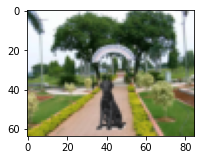

# EVA4 15 : Mask & Depth Prediction

### Submitted By ###
Deepjyoti Saha

## Overview
Till now, I have been playing with classification problems, which predict classes in a given image. In this exercise I have built a DNN which predicts images! This network takes two input images - an image with a foreground object & a background scene, and an image with only the background scene, and generates the mask for the foreground object and a depthmap of the image. How cool is that!

### Usage
```python

from utils import predict

## modelpath = <Absolute Path for Model File>
## filepath = <Absolute Path for Test Image Files>
## bg = <Filename for Background Image>
## image = <Filename for Image>

predict.predict_images(modelpath, filepath, bg,  image)
```

### Input & Output Images ###
The results were generated with input images that network has never seen.

|    Background (Input)     |     Image (Input).    |    Predicted Mask (Output).  | Predicted Depthmap (Output) |
| ---------------- | ---------------- | -------------- | ------------------ |
|   |   |   |   |
|   |   |   |   |
|   |   |   |   |
|   |   |   |   |


## Solution Approach

## Dataset 

## Data Pipeline

## Model


## Loss Function


## Training & Evaluation


## Results

