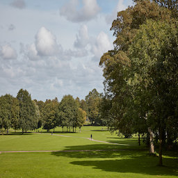
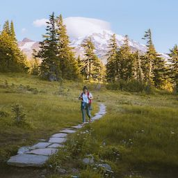
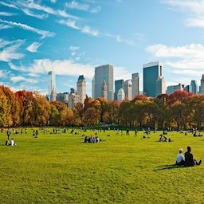
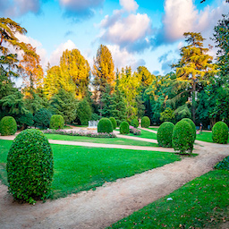

# EVA4 15A: Dataset Generation

## Dataset Download
You can download the complete dataset from the google drive link below
```
www.drive.google.com
```
## Background Images
     

## Foreground Images
     

## Foreground Mask Images
     

## Generated Images (superimpose foreground on background image)

## Masks for Generated Images 

## Depthmap for Generated Images
