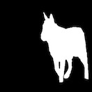
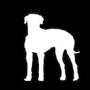
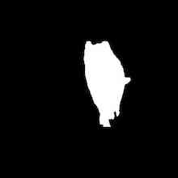
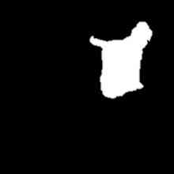
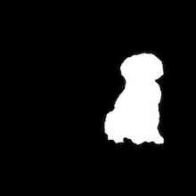
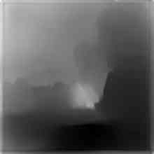
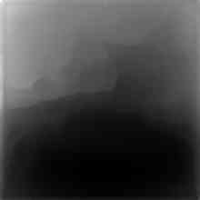
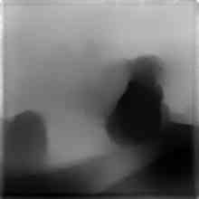
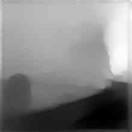

# EVA4 15A : Dataset Generation

## Dataset Download
You can download the complete dataset from the google drive link below
```
https://drive.google.com/drive/folders/1sdyGO83qvwteiXLBqJnxPH6NwgnVPZAq?usp=sharing
```
## Background Images
     

## Foreground Images
     

## Foreground Mask Images
     

## Generated Images (superimpose foreground on background image)
     

## Masks for Generated Images 
     

## Depthmap for Generated Images
     

## Dataset Description
The dataset consists of following types of images: </br>
* Background Images: These are images of a scene, in this case a park. These images are under the folder bg.
* Foreground Images: These are images of an object, in this case a dog with a transparent background. These images are under the folder fg.
* Foreground Mask Images:These are the mask images of the foreground image. Thse images are under the folder mask.
* Generated Images: These are images generated by superimposing the object on the scene, i.e, the dog on the park. For each foreground and background combination, the foreground images is superimposed at 20 random positions, and again flipped superimposed at 20 random postitions. These images are under the folder fg_bg.
* Mask for Generated Images: This is the mask for generated images. These images are under the folder fg_bg_mask.
* Depthmap Images:These are the depthmap images of the generated image, these are generated using a DepthDepth model. Thse images are under the folder depthmap.

### Total Count of Images ###

| Image Type  | Number of Images |
| ------------- | ------------- |
| Background Image  | 100  |
| Foreground Image  | 100  |
| Foreground Mask Image  | 100  |
| Generated Image  | 400000  |
| Generated Image Mask  | 400000  |
| Depthmap Image  | 150000 |

_Rest of the Depthmap Image Generation is in Progress_

## Dataset Generation Process
The following steps were followed to create the dataset: </br>
* Background Images: These images were downlaoded from the internet.
* Foreground Images: These images were downlaoded from the internet. The background from the images were removed using Microsoft Powerpoint "Remove Background" feature
* Foreground Mask Images: These images were generated using GIMP image editor. 
* Generated Images: These images were generated using a custom code. This code can be found here.
* Mask for Generated Images: These images were generated using a custom code. This code can be found here - [Dataset Generation Code Notebook](https://github.com/deepjyotisaha85/eva4/blob/master/session15A/S15A_Dataset_Generation.ipynb)
* Depthmap Images:These images were generated using a DenseDepth model. This code can be found here.
